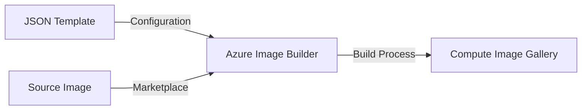

# Azure Image Builder

## Image deployment configurations and stages are found in the json (ARM) templates.
[reference to json template examples](https://github.com/Azure/azvmimagebuilder/tree/main/quickquickstarts) 

    * Define the ARM template and then configure the steps to customize the OS. 

    * A Managed Identity is able to access storage blobs during the deployment. 

    * Recommend using parameters to reduce the number of json templates to manage, and sensitive data. 

## Prepare the Deployment  
#
### Set your params  
_review the ARM template for available parameters_  

    $imageResourceGroup= ""
    $jsonTemplate= ""
    $imageTemplateName= ""

## Deploy an Image Template from the above ARM template.  
    
    New-AzResourceGroupDeployment `
        -ResourceGroupName $imageResourceGroup `
        -imageTemplateName $imageTemplateName `
        -TemplateFile $jsonTemplate
    

## Deploy the Image Template as an Image Version in the Azure Image Gallery.
    
    Invoke-AzResourceAction -ResourceGroupName $imageResourceGroup `
        -ResourceType Microsoft.VirtualMachineImages/imageTemplates `        
        -ResourceName $imageTemplateName `
        -Action Run -Force
    

### Azure Image Builder will deploy several resources in a dedicated Resource Group and will complete the customizations in the ARM template. 
_Deployment could take 30 minutes or more, and can be monitored under the Image Template's Activity Log in_ [Azure Portal](portal.azure.com)

#

### If the deployment is *successful* AIB will create a new Image Version in the corresponding VM Image Definition.  

_New versions can be located in the deployment ResourceGroup and under the Image Definition in the Azure Compute Gallery._

### If there are problems with the deployment AIB will automatically delete the artifacts. 

* Logs are available, locate the Resource Group where the Deployment failed.  
_example_: "IT_rg-avd-$env-images-eastus2"

* Under the Resource Group is a Storage Account, look in the Containers for 'packerlogs'.

* Download the log file and review for errors. 

<!-- updated Jan 26 2024 -->
