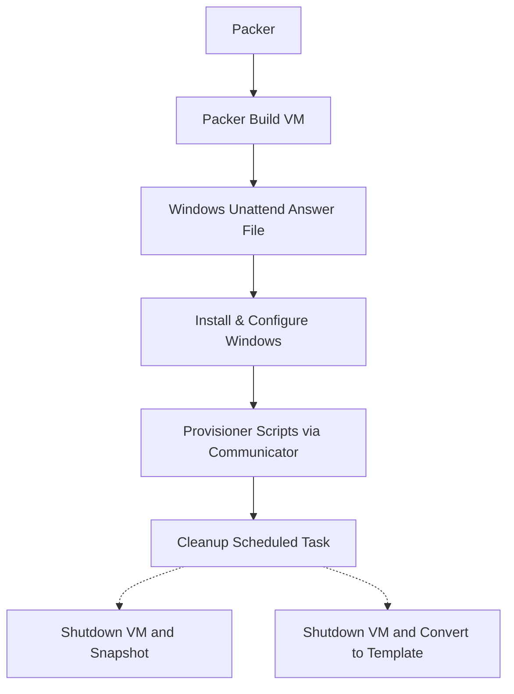

# Packer templates for Windows using vSphere-ISO provider  

This repository contains HashiCorp Packer templates to deploy Windows in VMware vCenter, using the `vsphere-iso` builder.  These Packer templates create VMWare VMs directly on the vSphere server and configure the guest OS.

## Build Process  



## PreRequisites  

### Service Accounts  

A vCenter and local WinRM Service Accounts are required to customize the operating system. The vCenter account is required to create and configure virtual machines. WinRM account is used to configure the operating systems. If no communicator is used, then there is no need for a WinRM account. The WinRM account and password are defined in the Windows AutoUnattend.xml answer file. **The WinRM username and password must match the AutoUnattend answer file.**  

### Windows AutoUnattend.xml 

Answer files (or AutoUnattend.xml) is used to configure Windows settings in the images during Setup. It can be used to select the version and location of Windows, insert product key, define language and region, configure user accounts, install drivers, and call scripts. The answer file is required for unattended installation, and packer is provided the path in the configuration.  

### vCenter Custom Role  
`PackerBuilder`

### Vsphere Custom Role/Permissions  

 - Datastore:<br>
    - Allocate space<br>
    - Browse datastore<br>
    - Low level file operations<br>
 - Host:<br>
    - Configuration<br>
        - System Management<br>
 - Network:<br>
    - Assign network<br>
 - Resource:<br>
    - Assign virtual machine to resource pool<br>
 - Virtual machine:<br>
    - Change Configuration<br>
        - Add new disk<br>
        - Add or remove device<br>
        - Advanced configuration<br>
        - Change CPU count<br>
        - Change Memory<br>
        - Change Settings<br>
        - Change resource<br>
        - Remove disk<br>
        - Set annotation<br>
    - Edit Inventory<br>
        - Create new<br>
        - Remove<br>
    - Interaction<br>
        - Configure CD media<br>
        - Configure floppy media<br>
        - Connect devices<br>
        - Console interaction<br>
        - Power off<br>
        - Power on<br>
    - Provisioning<br>
        - Mark as template<br>
    - Snapshot management<br>
        - Create snapshot<br>

### Install Packer  

- Download the binary [here](https://developer.hashicorp.com/packer/downloads)
- Copy `packer.exe` to directory that is a part of the system's `$env:Path` variable.
  - Example: '`C:\ProgramData\HashiCorp\`'  
- Create System Wide Variable for packer directory "PACKER_CONFIG_DIR".  
  - `[Environment]::SetEnvironmentVariable('PACKER_CONFIG_DIR', 'C:\ProgramData\HashiCorp\', 'Machine')`

### Install Required Plugins  

- Download Windows-Update plugin [here](https://github.com/rgl/packer-plugin-windows-update)  
- Download VMware Provider plugin [here](https://github.com/hashicorp/packer-plugin-vsphere)  
- Plugin directory defaults to '`$env:appdata/packer.d/`'  
- Confirm `$env:PACKER_CONFIG_DIR` points to same directory as where packer binary is located.  
- Plugins can be installed in the following location `$env:PACKER_CONFIG_DIR\packer.d\`  
- Example Plugins:  
  - `$env:PACKER_CONFIG_DIR\packer.d\plugins\github.com\hashicorp\vsphere\packer-plugin-vsphere_v1.1.0_x5.0_windows_amd64.exe`  
  - `$env:PACKER_CONFIG_DIR\packer.d\plugins\github.com\rgl\windows-update\packer-plugin-windows-update_v0.14.1_x5.0_windows_amd64.exe`  

### Configuration Files    

Packer can create a floppy drive that contains small files like autounattend.xml, bat/ps1 scripts, and drivers. You can use `floppy_file` with a list of files or `floppy_dirs` for recursive files. Packer will create a floppy drive, upload it to vCenter, and attach it to the imaging VM. 

Packer can also create an ISO file that supports larger files like a MSI or EXE. You can define the files that the ISO will include with `cd_files`. Use of this option assumes that you have a command line tool that can handle the iso creation. **oscdimg.exe** is a part of Windows ADK and works well for running packer from Windows.  

## Packer Procedures  

1. Format: `packer fmt template_name` 
2. Initialize: `packer init template_name`
3. Validate: `packer validate template_name`  
4. Execute: `packer build template_name`

## Variables  

- Variable File  
  - Example: `packer validate --var-file=var-files\DC1.pkrvars.hcl templates/win10_vdi`  
- Inline Variables  
  - Example: `packer validate --var network="vNET_001" templates/win10_vdi`  
- Environmental variables  
  - Example: `$env:PKR_VAR_username`  

### Variable order of ascending precedence:  

 1. variable default  
 2. environment variable  
 3. variable file(s)  
 4. command-line variable  

## Logging  

Packer supports logging by providing environmental variable. 
```  
$env:PACKER_LOG_PATH=".\manifests\vdi-$(Get-Date -f yyyyMMMdd_hh.mm.ss).log"  
$env:PACKER_LOG=1  
```  

## Credentials  

### Import Creds from CLIXML  

```
$creds = Import-Clixml -Path ".\$($env:USERNAME)_creds.xml"
$env:PKR_VAR_username = $creds.username
$env:PKR_VAR_password = $creds.GetNetworkCredential().password
```

### Prompt for Creds  

```
$env:PKR_VAR_username = $(Read-Host -Prompt "Enter User Name")
$secStringPassword = $(Read-Host -Prompt "Enter password" -AsSecureString)
$env:PKR_VAR_password = [System.Runtime.InteropServices.Marshal]::PtrToStringAuto([System.Runtime.InteropServices.Marshal]::SecureStringToBSTR($secStringPassword))
```

## Examples  

- `packer fmt -recursive templates`  
- `packer init templates/win10_vdi`  
- `packer validate --var-file=var-files\DC1.pkrvars.hcl templates/win10_vdi`     
- `packer build --var-file=var-files/DC1.pkrvars.hcl --var winrm_password="PackerPassword+" --except=win10_dev.vsphere-iso.win10_dev templates/win10_vdi`   
- `packer build --var-file=var-files/DC2.pkrvars.hcl templates/win10_vdi`  
- `packer build --var-file=var-files/DC1.pkrvars.hcl --only=win11_base.vsphere-iso.win11_base -force templates/win10_vdi`  

## Further Reading  

- [What is Packer](https://developer.hashicorp.com/packer/docs/intro)  
- [Packer terminology overview](https://developer.hashicorp.com/packer/docs/terminology)  
- [Packer Config Directory](https://developer.hashicorp.com/packer/docs/configure#packer-s-config-directory)  
- [vSphere Builder](https://developer.hashicorp.com/packer/plugins/builders/vsphere)  
- [VMware vSphere-ISO](https://developer.hashicorp.com/packer/plugins/builders/vsphere/vsphere-iso)  
- [vCenter Examples](https://github.com/hashicorp/packer-plugin-vsphere/tree/main/builder/vsphere/examples/windows)  
- [Example Autounattend.xml](https://github.com/jetbrains-infra/packer-builder-vsphere/blob/master/examples/windows/setup/Autounattend.xml)  
- [UnAttend Shell Setup](https://learn.microsoft.com/en-us/windows-hardware/customize/desktop/unattend/microsoft-windows-shell-setup)  
- [Oscdimg.exe](https://learn.microsoft.com/en-us/windows-hardware/manufacture/desktop/oscdimg-command-line-options?view=windows-10)
- [Communicators](https://developer.hashicorp.com/packer/docs/communicators) are required when using a provision task in the build file.  

<!-- END -->

<!-- 
## Examples ## 

### Deploy Horizon Reference and Golden Images in 319 (No Developer Image) ###  
```
packer build --var-file=var-files/DC1.pkrvars.hcl --var winrm_password="PackerPassword+" --except=win10_dev.vsphere-iso.win10_dev templates/win10_vdi
```


-->